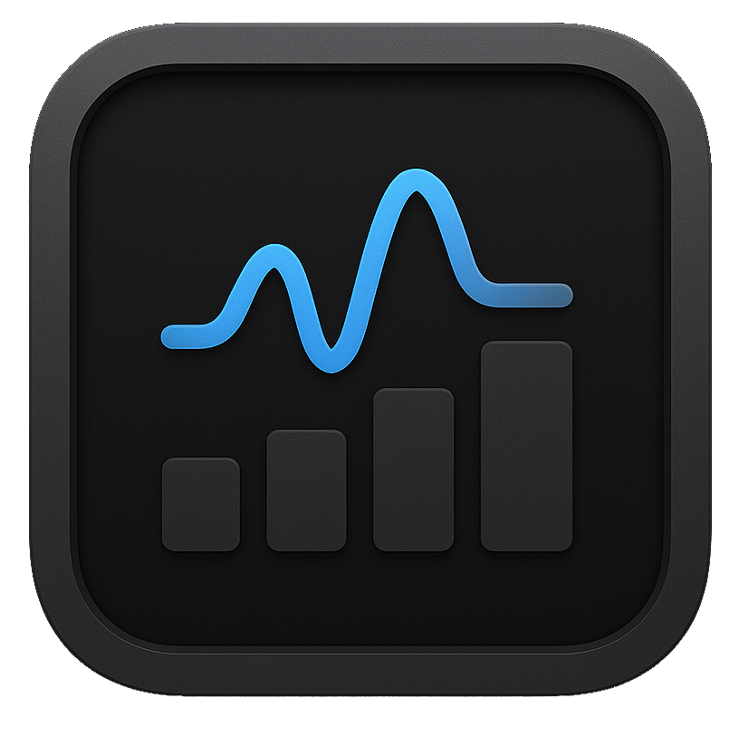
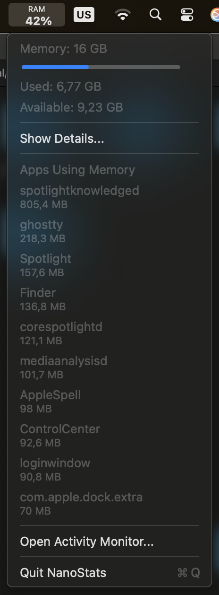

<!-- LOGO -->
<h1>

  
   NanoStats
</h1>
  

    A lightweight macOS status bar utility for monitoring system resources.
     
    <a href="#features">Features</a>
    ·
    <a href="">Download</a>
    ·
    <a href="">Documentation</a>
  

## Features

- ✅ RAM Usage - Shows memory usage with detailed breakdown
- ✅ CPU Usage - Shows CPU usage with user/system breakdown
- ✅ Battery - Shows battery level, uptime, and time remaining
- ✅ Compact Display - CPU usage graph and percentage in your menu bar

## Installation

1. Download the latest release from the Releases page
2. Move NanoStats.app to your Applications folder
3. Launch NanoStats

## Usage

Click the CPU graph and percentage in the menu bar to view detailed system stats including RAM, CPU, and battery information.

